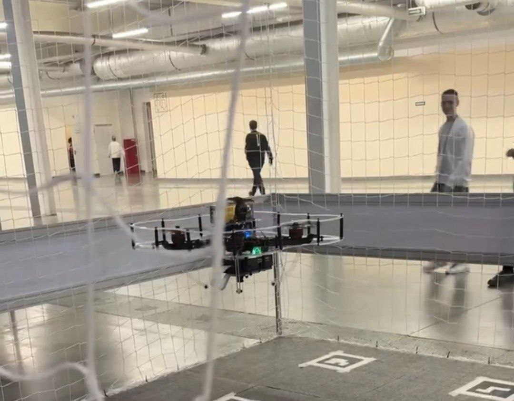
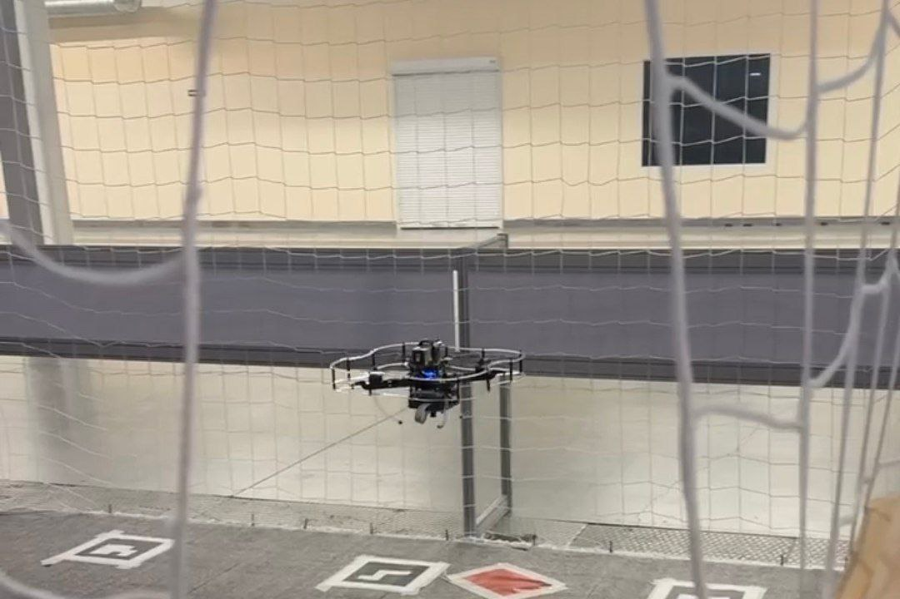

# Hi-tech-cows
## Team members:
1. Samodanov Matvey (hxllmvdx, *email - jigoku.tyan@gmail.com*)
2. Berezin Andrew (KR4K6, *email - berezin.aw@gmail.com*)
## Task:
Train an AI to detect cows and collect herd's parameters, install this algorithms on UAVs.
## Product tests:
1. Flight:




## Documentation:
You can see all documents in /docs directory.
## Solution architecture - [Miro-board](https://miro.com/app/board/uXjVJrzMiTw=/?share_link_id=553219309650)
## About model:
1. Model itself and It's purposes:
> To solve this task we chose YOLOv8n, because of It's light weight and corresponding speed. This parameters were essential for us because of RPi's limited computing power and our desire to make UAV with our model on board completely autonomous.
2. Model architecture:
> YOLOv8n utilizes classic YOLO architecture: It consists of Backbone (responsible for feature extracting), Neck (responsible for aggregation of multi-scale features) and Head (responsible for predicting bounding boxes and classes). Backbone - CSP + C2f, consists of conv-layers and SPPf. Neck utilizes modified PANet. Head is decoupled: two branches, one is regression (coordinates of bounding boxes), the other is classification (classes probability).
3. Model metrics:
> mAP@0.50:0.65=0.257
## Requirements:
1. Python3.11:
```bash
sudo apt update
sudo apt install python3.11 python3.11-venv python3.11-dev python3.11-pip
```
2. Rust:
```bash
sudo apt update
sudo apt upgrade -y
sudo apt install rustc cargo
echo 'export PATH="$HOME/.cargo/bin:$PATH"' >> ~/.bashrc
source ~/.bashrc
```
3. Python uv:
```bash
sudo apt update && sudo apt install curl -y
curl -LsSf https://astral.sh/uv/install.sh | sh
```
## Installation instructions:
Run:
```bash
git clone https://github.com/hxllmvdx/hi-tech-cows
chmod +x ~/hi-tech-cows/setup.sh
./hi-tech-cows/setup.sh
```
## Usage:
1. Open terminal in VNC-viewer (you must be connected to RPi through SSH)
2. Call
```bash
python3 ~/hi-tech-cows/src/inference.py
```
## Used packages:
- tflite_runtime (*lightweight*)
- opencv-python (*the best tool to work with images in python*)
- numpy (*has no rivals*)
- scikit-learn (*used for clustering*)
- alphashape (*the only lib to generate alphashape of points*)
- supervision (*to work with detections and visualising*)
- rospy (*to work with UAV*)
- sensor_msgs (*to work with UAV's sensors, in out case - camera*)
- cv_bridge (*connection between ROS and cv2*)
- other standart python packages
